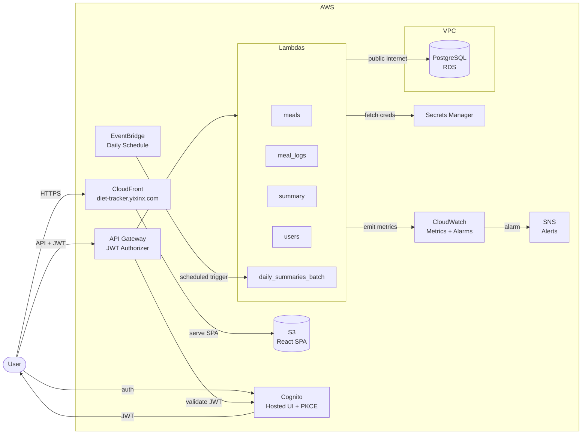

# Architecture Overview

This repository implements a small, serverless diet-tracking application on AWS. The goal is a secure, low-traffic system with minimal operational overhead.

## High-Level Flow



## Core Services
- **Frontend**: React 19 SPA hosted on S3 and served through CloudFront at `diet-tracker.yixinx.com`.
- **Auth**: Cognito User Pool with OAuth 2.0 Authorization Code + PKCE flow. API Gateway validates JWTs via a Cognito authorizer.
- **Backend**: Python 3.12 Lambdas (`meals`, `meal_logs`, `summary`, `users`, `daily_summaries_batch`), running outside the VPC for fast cold starts.
- **Data**: PostgreSQL on RDS (publicly accessible, inside a VPC), accessed through `backend/shared/db.py`. Connection reuse across warm Lambda invocations.
- **Secrets**: AWS Secrets Manager for DB connection info.
- **Networking**: RDS lives in a VPC with a security group allowing inbound access. Lambdas connect from the public internet, reaching both RDS and Secrets Manager directly.
- **Batch Processing**: `daily_summaries_batch` Lambda triggered by EventBridge on a daily schedule. Pre-computes daily calorie summaries, weekly reports, and nutrition anomaly detection. The summary API reads pre-computed data first, falling back to live calculation for same-day data.

## Lambda Responsibilities
- `meals`: CRUD for meals and ingredients; manages `meal_ingredients` associations.
- `meal_logs`: Log meals by date, list logs, delete logs.
- `summary`: Calculate daily totals from logged meals. Reads from pre-computed `daily_summaries` table when available, falls back to live aggregation for same-day data.
- `users`: Create or fetch user records from JWT claims.
- `daily_summaries_batch`: Scheduled batch job that pre-computes daily summaries, weekly reports, and detects nutritional anomalies (calories deviating >50% from 7-day rolling average).

## Repository Layout
```
backend/
  lambdas/          # Domain-specific Lambda handlers (meals, meal_logs, summary, users, daily_summaries_batch)
  shared/           # Auth, DB, response, validation, logging, metrics helpers
  tests/            # Pytest unit + integration suite
infra/
  sql/              # Database schema + migrations
  cloudwatch/       # Alarm and dashboard JSON definitions
frontend/           # Vite + React SPA source
  e2e/              # Playwright E2E tests
  mock-api/         # Local mock API server for testing
loadtests/          # Locust load test script + docs
docs/               # Architecture decision records (ADRs)
.github/workflows/  # CI/CD pipeline definitions
```

## CI/CD Pipeline
Deployments are automated through GitHub Actions with OIDC-based AWS authentication — no long-lived credentials are stored in GitHub.

**Workflow structure:**
- `test-backend.yml`: Runs pytest unit + integration tests on PR/push when `backend/` changes.
- `test-frontend.yml`: Runs ESLint + Playwright E2E tests on PR/push when `frontend/` changes.
- `deploy-staging.yml`: Triggers on push to `main`. Runs tests, then deploys backend (5 Lambdas in parallel via matrix strategy) and frontend to staging. Uses `dorny/paths-filter` to skip unchanged components.
- `deploy-prod.yml`: Manual trigger (`workflow_dispatch`). Runs the full test suite, requires reviewer approval on the `production` GitHub environment, then deploys to production with CloudFront cache invalidation.

**Environment separation:**
- Staging Lambdas are named `diet-tracker-staging-*`, frontend goes to `diet-tracker-ui-staging` S3 bucket.
- Production Lambdas are named `diet-tracker-*`, frontend goes to `diet-tracker-ui` S3 bucket, served via CloudFront.
- Backend infrastructure (API Gateway, RDS, Cognito) is shared between environments to minimize cost. See ADR-013 in [`docs/architecture-decisions.md`](docs/architecture-decisions.md).

## Observability
- **Structured logging**: All Lambdas emit JSON-formatted logs via a custom `StructuredLogger` (`backend/shared/logging.py`), enabling CloudWatch Logs Insights queries by user_id, operation, or error type.
- **Custom metrics**: `backend/shared/metrics.py` emits metrics under the `DietTracker` CloudWatch namespace (request latency, DB query time). Wrapped in try/except so monitoring failures never crash the application.
- **Alarms**: Five CloudWatch alarms defined in `infra/cloudwatch/alarms.json` — high Lambda error rate, high p99 latency, slow database queries, batch job failures, and RDS CPU saturation. All notify via SNS email.

## Testing Strategy
- **Backend**: pytest unit tests (handler logic, shared modules) and integration tests. Run in CI on every PR and push.
- **Frontend**: ESLint for linting, Playwright E2E tests against a local mock API server (`frontend/mock-api/server.js`). Auth bypassed via `VITE_AUTH_BYPASS=1`. Playwright reports uploaded as CI artifacts.
- **Load testing**: Locust-based performance tests (`loadtests/locustfile.py`) simulating realistic user sessions with weighted read/write patterns. Automatic test data cleanup and a 5% error rate threshold.
- **Mock API trade-off**: E2E tests are fast and deterministic but don't validate the full stack. Backend tests and occasional manual smoke tests fill this gap. See ADR-012.

## Deployment Notes
Environment variables `DB_SECRET_ARN`, `DB_NAME`, and `ALLOWED_ORIGIN` must be configured for each Lambda. `ALLOWED_ORIGIN` should be set to the custom domain (`https://diet-tracker.yixinx.com`). `LOG_LEVEL` is optional for runtime logging.
Lambdas run outside the VPC — no VPC configuration is needed in the deployment workflow.

## Local Development Notes
- The frontend can run against a mock API server in `frontend/mock-api/server.js`.
- `VITE_AUTH_BYPASS=1` bypasses Cognito for local E2E tests and injects test tokens.

## Architecture Decisions
All major technical decisions are documented as Architecture Decision Records (ADRs) in [`docs/architecture-decisions.md`](docs/architecture-decisions.md), covering compute, data, auth, frontend, CI/CD, observability, testing, and cost optimization trade-offs.
