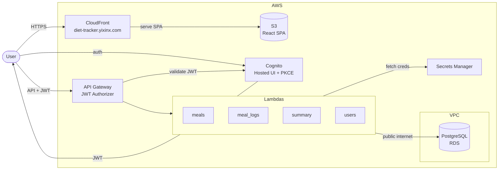

# Architecture Overview

This repository implements a small, serverless diet-tracking application on AWS. The goal is a secure, low-traffic system with minimal operational overhead.

## High-Level Flow



## Core Services
- **Frontend**: React SPA hosted on S3 and served through CloudFront at `diet-tracker.yixinx.com`.
- **Auth**: Cognito User Pool with JWT authorizer in API Gateway.
- **Backend**: Python 3.12 Lambdas (`meals`, `meal_logs`, `summary`, `users`), running outside the VPC.
- **Data**: PostgreSQL on RDS (publicly accessible, inside a VPC), accessed through `backend/shared/db.py`.
- **Secrets**: AWS Secrets Manager for DB connection info.
- **Networking**: RDS lives in a VPC with a security group allowing inbound access. Lambdas connect from the public internet, reaching both RDS and Secrets Manager directly.
- **Testing**: Frontend Playwright E2E tests using a local mock API.

## Lambda Responsibilities
- `meals`: CRUD for meals and ingredients; manages `meal_ingredients` associations.
- `meal_logs`: Log meals by date, list logs, delete logs.
- `summary`: Calculate daily totals from logged meals.
- `users`: Create or fetch user records from JWT claims.

## Repository Layout
```
backend/
  lambdas/        # Domain-specific Lambda handlers
  shared/         # Auth, DB, response, validation, logging helpers
  tests/          # Pytest suite for backend
infra/sql/        # Database schema
frontend/         # Vite + React SPA source
```

## Deployment Notes
Lambdas are deployed via GitHub Actions using OIDC-based AWS credentials. Environment variables `DB_SECRET_ARN`, `DB_NAME`, and `ALLOWED_ORIGIN` must be configured for each Lambda. `ALLOWED_ORIGIN` should be set to the custom domain (`https://diet-tracker.yixinx.com`). `LOG_LEVEL` is optional for runtime logging.
Lambdas run outside the VPC — no VPC configuration is needed in the deployment workflow.

## Local Development Notes
- The frontend can run against a mock API server in `frontend/mock-api/server.js`.
- `VITE_AUTH_BYPASS=1` bypasses Cognito for local E2E tests and injects test tokens.
