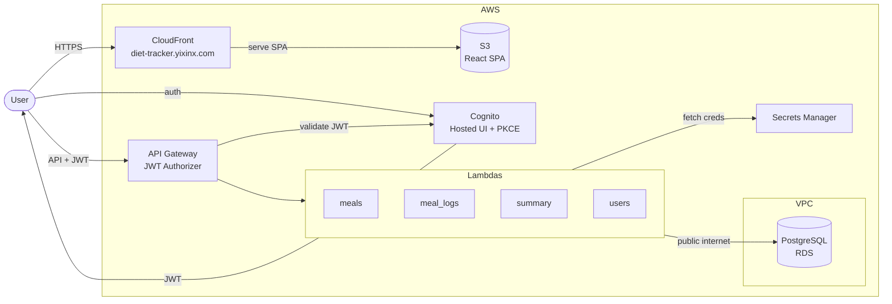

# Diet Tracker – Serverless AWS Application

A personal, low-cost, serverless diet tracking web application built on AWS. The app allows authenticated users to create reusable meals (recipes), define ingredients with calorie values, log meals per day, and automatically calculate daily calorie intake.

This project is designed to be **simple, secure, and free-tier friendly**, while still following production-grade architectural best practices.

---

## 🏗️ Architecture Overview



### Key Security Properties

* No AWS credentials in the browser
* JWT-based authentication only
* All database access isolated in Lambda
* Secrets never stored in code or frontend

---

## 🧱 Tech Stack

### Frontend

* Vite + React (SPA)
* Hosted on Amazon S3 and served via CloudFront
* Custom domain: `diet-tracker.yixinx.com` (via CloudFront alternate domain + ACM certificate)
* Cognito Hosted UI for authentication

### Backend

* AWS API Gateway (REST API)
* AWS Lambda (Python 3.12)
* Amazon RDS (PostgreSQL)
* AWS Secrets Manager

### Authentication & Security

* AWS Cognito User Pool
* OAuth 2.0 Authorization Code + PKCE
* JWT-based API authorization
* Encrypted database storage

### Networking

* Amazon VPC for RDS isolation
* RDS is publicly accessible (Lambda connects from outside the VPC)
* Security group controls inbound access to the database

### Infrastructure & CI/CD

* GitHub for source control
* GitHub Actions for Lambda deployments
* AWS IAM (least-privilege roles)
* ACM certificate for custom domain HTTPS
* Playwright for frontend E2E tests (mock API)

---

## 🔐 Authentication Flow

1. User clicks **Login** in the React app
2. Redirected to Cognito Hosted UI
3. User authenticates with username/password
4. Cognito redirects back with auth code
5. React app exchanges code for JWT tokens
6. JWT is sent with API requests
7. API Gateway validates JWT via Cognito authorizer

Note: the frontend currently sends the Cognito ID token as the Bearer token for API requests.

---

## 🧪 Local Development & Testing

### Frontend

* API base URL is configured in `frontend/.env.local` via `VITE_API_BASE_URL`.
* A mock API server lives at `frontend/mock-api/server.js`.
* `npm run mock-api` starts the mock server.
* `npm run test:e2e` starts the dev server + mock API and runs Playwright tests in `frontend/e2e`.
* `VITE_AUTH_BYPASS=1` bypasses Cognito for tests (injects test tokens in the frontend).

### CI/CD notes

* Lambda deploys use `aws-actions/aws-lambda-deploy@v1`.
* Lambdas run outside the VPC (no VPC configuration needed).
* Environment variables `DB_SECRET_ARN`, `DB_NAME`, and `ALLOWED_ORIGIN` are injected via GitHub Actions secrets.

---

## 🗄️ Database Schema (PostgreSQL)

Canonical DDL lives in `infra/sql/schema.sql`.

### users

* `id (UUID, PK)`
* `cognito_user_id (unique)`
* `email (unique)`
* `created_at`

### ingredients

* `id (UUID, PK)`
* `user_id (FK → users)`
* `name`
* `calories_per_unit`
* `unit`

### meals (recipes)

* `id (UUID, PK)`
* `user_id (FK → users)`
* `name`
* `total_calories`
* `created_at`

### meal_ingredients

* `id (UUID, PK)`
* `meal_id (FK → meals)`
* `ingredient_id (FK → ingredients)`
* `quantity`

### meal_logs

* `id (UUID, PK)`
* `user_id (FK → users)`
* `meal_id (FK → meals)`
* `date (date)`
* `quantity`

---

## 🔌 API Endpoints

Below is the **complete set of API endpoints** required to support the application. All endpoints are protected by a **Cognito User Pool JWT authorizer**.

---

### 🍽️ Meals & Ingredients

**Lambda:** `meals`

#### Ingredients

| Method | Endpoint            | Description             |
| ------ | ------------------- | ----------------------- |
| POST   | `/ingredients`      | Create a new ingredient |
| GET    | `/ingredients`      | List all ingredients    |
| PUT    | `/ingredients/{id}` | Update an ingredient    |
| DELETE | `/ingredients/{id}` | Delete an ingredient    |

#### Meals (Recipes)

| Method | Endpoint      | Description                    |
| ------ | ------------- | ------------------------------ |
| POST   | `/meals`      | Create a meal with ingredients |
| GET    | `/meals`      | List meals                     |
| GET    | `/meals/{id}` | Get meal details               |
| PUT    | `/meals/{id}` | Update a meal                  |
| DELETE | `/meals/{id}` | Delete a meal                  |

List endpoints support optional pagination query params: `limit` and `offset`.

---

### 🗓️ Meal Logs

**Lambda:** `meal_logs`

| Method | Endpoint          | Description                            |
| ------ | ----------------- | -------------------------------------- |
| POST   | `/meal-logs`      | Log a meal for a specific date         |
| GET    | `/meal-logs`      | List logged meals (filterable by date) |
| DELETE | `/meal-logs/{id}` | Delete a logged meal                   |

`/meal-logs` supports optional `from` and `to` date filters plus `limit` and `offset`.

---

### 📊 Daily Summary

**Lambda:** `summary`

| Method | Endpoint                                       | Description                    |
| ------ | ---------------------------------------------- | ------------------------------ |
| GET    | `/daily-summary?date=YYYY-MM-DD`               | Total calories for a day       |
| GET    | `/daily-summary?from=YYYY-MM-DD&to=YYYY-MM-DD` | Calorie totals over date range |

---

### 👤 User Bootstrap (Optional)

**Lambda:** `users`

| Method | Endpoint           | Description                        |
| ------ | ------------------ | ---------------------------------- |
| POST   | `/users/bootstrap` | Create user record from JWT claims |
| GET    | `/users/me`        | Get current user profile           |

---

### 🔒 Authentication Notes

* Authentication is handled by **AWS Cognito Hosted UI**
* No `/login`, `/logout`, or `/register` endpoints are required
* JWT tokens must be sent as:

  ```http
  Authorization: Bearer <JWT>
  ```

---

## 📁 Repository Structure

```text
diet-tracker/
├── frontend/              # Vite + React SPA
│   ├── package.json
│   ├── public/
│   └── src/
│       ├── auth/          # Cognito auth helpers
│       ├── api/           # API client wrappers
│       ├── components/    # Reusable UI components
│       ├── pages/         # App pages / views
│       └── App.jsx
│
├── backend/
│   ├── lambdas/
│   │   ├── meals/
│   │   │   └── handler.py
│   │   ├── meal_logs/
│   │   │   └── handler.py
│   │   ├── summary/
│   │   │   └── handler.py
│   │   └── users/
│   │       └── handler.py
│   │
│   ├── shared/
│   │   ├── db.py          # DB connection logic
│   │   ├── auth.py        # Cognito claim helpers
│   │   ├── response.py    # JSON + CORS responses
│   │   ├── validation.py  # UUID/date validation helpers
│   │   └── logging.py     # Structured logger helper
│   │
│   ├── tests/             # Pytest suite
│   ├── Pipfile
│   └── Pipfile.lock
│
├── infra/
│   └── sql/
│       └── schema.sql
│
├── .github/
│   └── workflows/
│       └── deploy-lambdas.yml
│
├── ARCHITECTURE.md
├── README.md
└── .gitignore
```

---

## 🧪 Local Development

### Frontend

```bash
cd frontend
npm install
npm run dev
```

### Backend

```bash
cd backend
pipenv install --dev
pipenv run pytest
```

---

## 🚀 Deployment

### Frontend

1. Install dependencies

   ```bash
   cd frontend
   npm install
   ```
2. Build the React app

   ```bash
   npm run build
   ```
3. Upload `frontend/dist/` to the S3 bucket
4. Served via CloudFront distribution (OAC + private bucket) at `diet-tracker.yixinx.com`

### Backend (via GitHub Actions)

* Push to `main` or `lambda-deployment` branch triggers deployment
* Lambda functions packaged and deployed
* Environment variables injected at deploy time: `DB_SECRET_ARN`, `DB_NAME`, `ALLOWED_ORIGIN` (should match the custom domain), optional `LOG_LEVEL`

---

## 💰 Cost Considerations

Designed to remain within AWS Free Tier:

* S3: Free
* Cognito: Free (low MAU)
* Lambda: Free
* API Gateway: Free
* RDS: Free for first 12 months

After free tier, expected cost is dominated by RDS (~$12–15/month).

---

## 🧭 Project Goals

* Simple, personal-use diet tracking
* Accurate calorie calculation
* Minimal AWS complexity
* Secure-by-default architecture
* Easy to extend in the future

---

## 📌 Future Enhancements (Optional)

* SQL views for calorie aggregation
* Charts and weekly summaries
* Direct S3 uploads for images
* Mobile-friendly UI

---

## 📄 License

MIT (or your preferred license)
