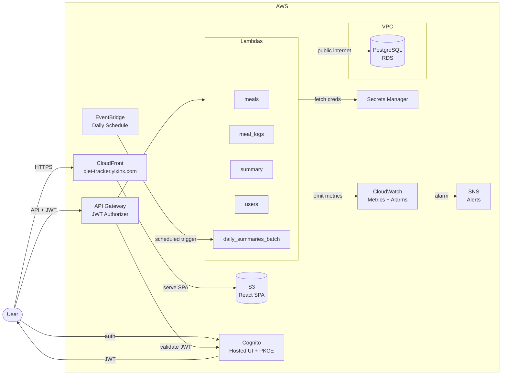

# Diet Tracker – Serverless AWS Application

A personal, low-cost, serverless diet tracking web application built on AWS. The app allows authenticated users to create reusable meals (recipes), define ingredients with calorie values, log meals per day, and automatically calculate daily calorie intake.

This project is designed to be **simple, secure, and free-tier friendly**, while still following production-grade architectural best practices.

---

## 🏗️ Architecture Overview



### Key Security Properties

* No AWS credentials in the browser
* JWT-based authentication only
* All database access isolated in Lambda
* Secrets never stored in code or frontend

For detailed reasoning behind every architectural decision, see [`docs/architecture-decisions.md`](docs/architecture-decisions.md).

---

## 🧱 Tech Stack

### Frontend

* Vite + React (SPA)
* Hosted on Amazon S3 and served via CloudFront
* Custom domain: `diet-tracker.yixinx.com` (via CloudFront alternate domain + ACM certificate)
* Cognito Hosted UI for authentication

### Backend

* AWS API Gateway (REST API)
* AWS Lambda (Python 3.12)
* Amazon RDS (PostgreSQL)
* AWS Secrets Manager

### Authentication & Security

* AWS Cognito User Pool
* OAuth 2.0 Authorization Code + PKCE
* JWT-based API authorization
* Encrypted database storage

### Networking

* Amazon VPC for RDS isolation
* RDS is publicly accessible (Lambda connects from outside the VPC)
* Security group controls inbound access to the database

### Infrastructure & CI/CD

* GitHub Actions CI/CD with OIDC authentication (no long-lived AWS credentials)
* Separate GitHub environments: `staging` (auto-deploy on push to main) and `production` (manual trigger + required reviewer approval)
* Path-filtered workflows — only rebuilds what changed (`dorny/paths-filter`)
* AWS IAM (least-privilege roles)
* ACM certificate for custom domain HTTPS

### Testing & Quality

* Backend: pytest unit + integration tests with coverage reporting
* Frontend: ESLint + Playwright E2E tests against a local mock API
* Load testing: Locust-based performance tests simulating realistic user sessions
* Playwright reports uploaded as GitHub Actions artifacts (30-day retention)

### Observability

* Structured JSON logging via custom `StructuredLogger`
* Custom CloudWatch metrics under the `DietTracker` namespace (request latency, DB query time)
* CloudWatch alarms: high error rate, high p99 latency, slow DB queries, batch job failures, RDS CPU
* SNS email notifications when alarms fire

---

## 🔐 Authentication Flow

1. User clicks **Login** in the React app
2. Redirected to Cognito Hosted UI
3. User authenticates with username/password
4. Cognito redirects back with auth code
5. React app exchanges code for JWT tokens
6. JWT is sent with API requests
7. API Gateway validates JWT via Cognito authorizer

Note: the frontend currently sends the Cognito ID token as the Bearer token for API requests.

---

## 🧪 Local Development & Testing

### Frontend

* API base URL is configured in `frontend/.env.local` via `VITE_API_BASE_URL`.
* A mock API server lives at `frontend/mock-api/server.js`.
* `npm run mock-api` starts the mock server.
* `npm run test:e2e` starts the dev server + mock API and runs Playwright tests in `frontend/e2e`.
* `VITE_AUTH_BYPASS=1` bypasses Cognito for tests (injects test tokens in the frontend).

### Load Testing

Run the Locust load test suite against a live API:

```bash
pip install locust
export AUTH_TOKEN="<valid-cognito-id-token>"
locust -f loadtests/locustfile.py \
    --host https://<api-url> \
    --headless -u 10 -r 2 -t 60s
```

The test simulates realistic user sessions (weighted toward reads), cleans up test data on completion, and fails the run if the error rate exceeds 5%. See `loadtests/README.md` for details.

---

## 🗄️ Database Schema (PostgreSQL)

Canonical DDL lives in `infra/sql/schema.sql`.

### users

* `id (UUID, PK)`
* `cognito_user_id (unique)`
* `email (unique)`
* `created_at`

### ingredients

* `id (UUID, PK)`
* `user_id (FK → users)`
* `name`
* `calories_per_unit`
* `unit`

### meals (recipes)

* `id (UUID, PK)`
* `user_id (FK → users)`
* `name`
* `total_calories`
* `created_at`

### meal_ingredients

* `id (UUID, PK)`
* `meal_id (FK → meals)`
* `ingredient_id (FK → ingredients)`
* `quantity`

### meal_logs

* `id (UUID, PK)`
* `user_id (FK → users)`
* `meal_id (FK → meals)`
* `date (date)`
* `quantity`

---

## 🔌 API Endpoints

Below is the **complete set of API endpoints** required to support the application. All endpoints are protected by a **Cognito User Pool JWT authorizer**.

---

### 🍽️ Meals & Ingredients

**Lambda:** `meals`

#### Ingredients

| Method | Endpoint            | Description             |
| ------ | ------------------- | ----------------------- |
| POST   | `/ingredients`      | Create a new ingredient |
| GET    | `/ingredients`      | List all ingredients    |
| PUT    | `/ingredients/{id}` | Update an ingredient    |
| DELETE | `/ingredients/{id}` | Delete an ingredient    |

#### Meals (Recipes)

| Method | Endpoint      | Description                    |
| ------ | ------------- | ------------------------------ |
| POST   | `/meals`      | Create a meal with ingredients |
| GET    | `/meals`      | List meals                     |
| GET    | `/meals/{id}` | Get meal details               |
| PUT    | `/meals/{id}` | Update a meal                  |
| DELETE | `/meals/{id}` | Delete a meal                  |

List endpoints support optional pagination query params: `limit` and `offset`.

---

### 🗓️ Meal Logs

**Lambda:** `meal_logs`

| Method | Endpoint          | Description                            |
| ------ | ----------------- | -------------------------------------- |
| POST   | `/meal-logs`      | Log a meal for a specific date         |
| GET    | `/meal-logs`      | List logged meals (filterable by date) |
| DELETE | `/meal-logs/{id}` | Delete a logged meal                   |

`/meal-logs` supports optional `from` and `to` date filters plus `limit` and `offset`.

---

### 📊 Daily Summary

**Lambda:** `summary`

| Method | Endpoint                                       | Description                    |
| ------ | ---------------------------------------------- | ------------------------------ |
| GET    | `/daily-summary?date=YYYY-MM-DD`               | Total calories for a day       |
| GET    | `/daily-summary?from=YYYY-MM-DD&to=YYYY-MM-DD` | Calorie totals over date range |

---

### 👤 User Bootstrap (Optional)

**Lambda:** `users`

| Method | Endpoint           | Description                        |
| ------ | ------------------ | ---------------------------------- |
| POST   | `/users/bootstrap` | Create user record from JWT claims |
| GET    | `/users/me`        | Get current user profile           |

---

### 🔒 Authentication Notes

* Authentication is handled by **AWS Cognito Hosted UI**
* No `/login`, `/logout`, or `/register` endpoints are required
* JWT tokens must be sent as:

  ```http
  Authorization: Bearer <JWT>
  ```

---

## 📁 Repository Structure

```text
diet-tracker/
├── frontend/                # Vite + React SPA
│   ├── src/
│   │   ├── auth/            # Cognito auth helpers
│   │   ├── api/             # API client wrappers
│   │   ├── App.jsx
│   │   ├── App.css
│   │   └── index.css        # Design system (CSS custom properties)
│   ├── e2e/                 # Playwright E2E tests
│   ├── mock-api/            # Local mock API server for testing
│   ├── playwright.config.js
│   └── package.json
│
├── backend/
│   ├── lambdas/
│   │   ├── meals/           # Ingredients + meals CRUD
│   │   ├── meal_logs/       # Meal logging
│   │   ├── summary/         # Daily/range calorie summaries
│   │   ├── users/           # User bootstrap + profile
│   │   └── daily_summaries_batch/  # Scheduled batch pre-computation
│   ├── shared/
│   │   ├── db.py            # DB connection logic
│   │   ├── auth.py          # Cognito claim helpers
│   │   ├── response.py      # JSON + CORS responses
│   │   ├── validation.py    # UUID/date validation helpers
│   │   ├── logging.py       # Structured JSON logger
│   │   └── metrics.py       # CloudWatch custom metrics
│   ├── tests/               # Pytest unit + integration suite
│   ├── Pipfile
│   └── Pipfile.lock
│
├── infra/
│   ├── sql/                 # Database schema + migrations
│   └── cloudwatch/          # Alarm and dashboard JSON definitions
│
├── loadtests/
│   ├── locustfile.py        # Locust load test script
│   └── README.md            # Load testing documentation
│
├── docs/
│   └── architecture-decisions.md  # ADRs (13 decisions)
│
├── .github/
│   └── workflows/
│       ├── test-backend.yml       # PR/push: pytest suite
│       ├── test-frontend.yml      # PR/push: ESLint + Playwright
│       ├── deploy-staging.yml     # Auto-deploy to staging on push to main
│       └── deploy-prod.yml        # Manual production deploy + approval gate
│
├── ARCHITECTURE.md
├── README.md
└── CLAUDE.md
```

---

## 🧪 Local Development

### Frontend

```bash
cd frontend
npm install
npm run dev
```

### Backend

```bash
cd backend
pipenv install --dev
pipenv run pytest
```

---

## 🚀 Deployment

All deployments are automated through GitHub Actions with OIDC-based AWS authentication (no long-lived credentials).

### CI/CD Pipeline

```
Push to main
  ├── paths-filter detects changed files
  ├── Test Backend (pytest unit + integration) ─── if backend/ changed
  ├── Test Frontend (ESLint + Playwright E2E) ─── if frontend/ changed
  ├── Deploy Backend to Staging ─── after tests pass
  └── Deploy Frontend to Staging ─── after tests pass

Manual trigger (workflow_dispatch)
  ├── Full test suite (backend + frontend)
  ├── Required reviewer approval (production environment)
  ├── Deploy Backend to Production
  └── Deploy Frontend to Production + CloudFront invalidation
```

### Environment Configuration

* **Staging**: Auto-deploys on push to `main`. Lambda functions named `diet-tracker-staging-*`, frontend synced to `diet-tracker-ui-staging` S3 bucket.
* **Production**: Manual trigger with required reviewer approval. Lambda functions named `diet-tracker-*`, frontend synced to `diet-tracker-ui` S3 bucket and served via CloudFront at `diet-tracker.yixinx.com`.
* Environment variables injected at deploy time: `DB_SECRET_ARN`, `DB_NAME`, `ALLOWED_ORIGIN`, optional `LOG_LEVEL`.

---

## 💰 Cost Considerations

Designed to remain within AWS Free Tier:

* S3: Free
* Cognito: Free (low MAU)
* Lambda: Free
* API Gateway: Free
* RDS: Free for first 12 months

After free tier, expected cost is dominated by RDS (~$12–15/month).

---

## 🧭 Project Goals

* Simple, personal-use diet tracking with accurate calorie calculation
* Secure-by-default architecture (JWT auth, least-privilege IAM, Secrets Manager)
* Production-grade CI/CD with test gates and environment separation
* Observability through structured logging, custom metrics, and alerting
* Cost-optimized for low-traffic workloads (free-tier friendly)
* Documented architectural decisions with clear trade-off reasoning

---

## 📌 Future Enhancements (Optional)

* Infrastructure-as-Code (AWS CDK) for reproducible environments
* Isolated staging backend (separate API Gateway stage, Lambda aliases, RDS schema)
* Direct S3 uploads for meal/ingredient images
* CloudWatch dashboard for real-time operational visibility

---

## 📄 License

MIT (or your preferred license)
